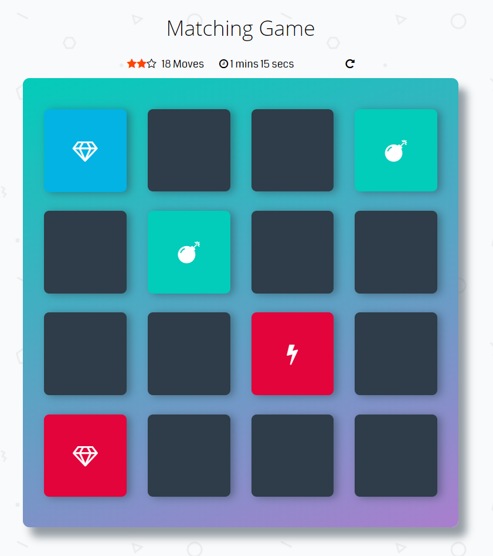

# Memory Game Project

## What's Momory Game?

It is a card game in which all of the cards are laid face down on a surface and two cards are flipped face up over each turn. The object of the game is to turn over pairs of matching --[Wikipedia](https://en.wikipedia.org/wiki/Concentration_(game)).

> also known as Concentration Game, Match Match or Pairs Memory Game.

## How the game is played?
- Click [here](https://mosamy19.github.io/fend-memory-game) th start playing.
- Click on cards to find the matching pairs.

## Game dependencies
This is my solution for Udacity **Frontend Nanodegree** Memory Game project.

I used Vanilla Javascript, ES2015, [animate.css](https://daneden.github.io/animate.css/) and [FontAwesome icons set](https://fontawesome.com/)
  for building this game.

## Live demo
Watch the live demo of the game! [here](https://mosamy19.github.io/fend-memory-game)